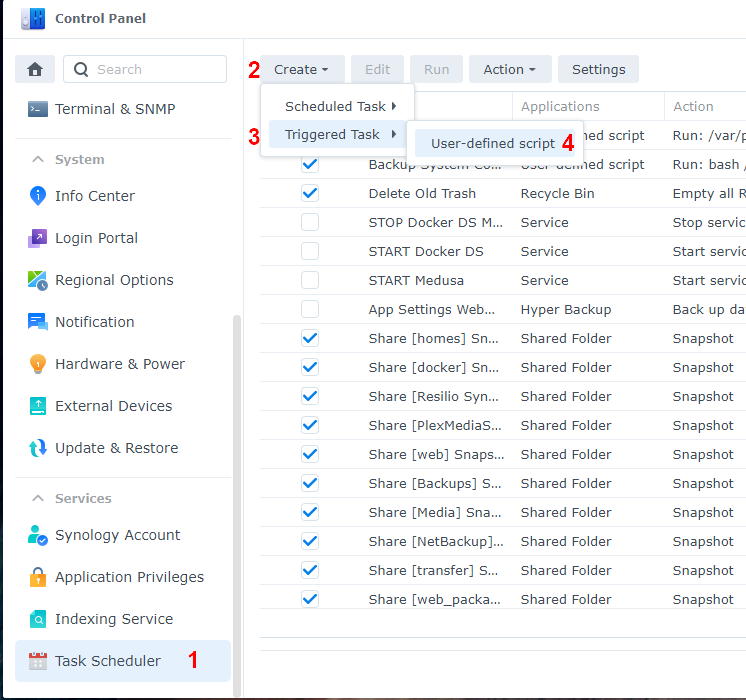

### Описание

Добавьте жесткие и твердотельные накопители SATA или SAS, а также диски SATA и NVMe M.2 в базы данных совместимых дисков Synology, включая базы данных карты Synology M.2 PCIe и модулей расширения.

Сценарий работает в DSM 7, включая DSM 7.2 и DSM 6.

Он также имеет опцию восстановления, позволяющую отменить все изменения, внесенные сценарием.

#### Что делает скрипт:

* Получает модель Synology NAS и версию DSM (чтобы знать, какие файлы базы данных нужно редактировать).
* Получает список жестких дисков, твердотельных накопителей, SAS и NVMe, установленных в Synology NAS.
* Получает номер модели и версию прошивки каждого накопителя.
* Создает резервные копии файлов базы данных, если резервных копий еще нет.
* Проверяет, находится ли каждый диск в базе данных совместимых дисков Synology.
* Добавляет все недостающие диски в базу данных совместимых дисков Synology.
* При необходимости предотвращает автоматическое обновление базы данных диска DSM.
* При желании отключите «support_disk_compatibility» DSM.
* При необходимости отключите «support_memory_compatibility» DSM, чтобы предотвратить уведомления о памяти, отличной от Synology .
* При необходимости редактируется максимальный поддерживаемый объем памяти в соответствии с объемом установленной памяти, если установленная память превышает текущий параметр максимального объема памяти.
    * DSM использует только параметр максимального объема памяти при расчете размера зарезервированной области ОЗУ для кэшей SSD.
* При необходимости отключает Western Digital Device Analytics (также известный как WDDA), чтобы DSM не отображал предупреждение о накопителях WD трехлетней давности.
    * В DSM 7.2.1 WDDA уже отключен.
* Включает M2D20, M2D18, M2D17 и E10M20-T1, если они присутствуют на Synology NAS, которые официально их не поддерживают.
    * Для более новых моделей NAS также может потребоваться **Synology_enable_M2_card**
* Проверяет, включена ли поддержка тома M.2 (на моделях со слотами M.2 или PCIe).
* Позволяет создавать пулы и тома хранения данных M.2 из Storage Manager (только для более новых моделей?).
    * Включая диски M.2 в адаптерные карты PCIe, такие как M2D20, M2D18, M2D17 и E10M20-T1 для DSM 7.2.1 и более поздних версий (необходимо запускать сценарий после каждой загрузки) .
* Заставляет DSM повторно проверять совместимость дисков, поэтому перезагрузка не требуется, если у вас нет дисков M.2 (только DSM 7).
    * **Если у вас есть диски M.2, возможно, вам потребуется перезагрузка.**
    * Напоминает, что вам может потребоваться перезагрузить Synology после запуска сценария.
* Проверяет, существует ли более новая версия этого скрипта, и предлагает вам ее скачать.
  * Время ожидания доступных сообщений новой версии истекает, поэтому они не мешают запуску сценария, если он запланирован на автоматическое выполнение.

### Скачать сценарий

1. Загрузите исходный код последней версии (zip) с https://github.com/007revad/Synology_HDD_db/releases/tag/v3.5.89
2. Сохраните загруженный zip-файл в папку на Synology.
    - **НЕ сохраняйте сценарий на томе M.2.** После обновления DSM или Storage Manager том M.2 не будет доступен до тех пор, пока не запустится сценарий.
3. Разархивируйте zip-файл.

### Когда запускать скрипт

После обновления DSM вам потребуется повторно запустить сценарий. Если в DSM настроено автоматическое обновление, лучшим вариантом будет запускать сценарий каждый раз при загрузке Synology, а лучший способ сделать это — **настроить запланированное задание** для запуска сценария при загрузке.

**Примечание:** После первого запуска сценария вам может потребоваться перезагрузить Synology, чтобы увидеть эффект изменений.

# Как запланировать сценарий в Synology

Чтобы запланировать запуск сценария на Synology при загрузке или завершении работы, выполните следующие действия:

**Примечание.:** Вы можете настроить задачу расписания и оставить ее отключенной, чтобы она запускалась только тогда, когда вы выбираете задачу в планировщике задач и нажимаете кнопку «Выполнить».

1. Перейдите в «Панель управления» > «Планировщик заданий» > нажмите «Создать» > и выберите «Запускаемая задача» .
2. Выберите Пользовательский сценарий.
3. Введите имя задачи.
4. Выберите root в качестве пользователя (сценарий должен запускаться от имени root).
5. Выберите «Загрузка» в качестве события, запускающего задачу.
6. Оставьте галочку «Включить ».
7. Нажмите «Настройки задачи» .
8. При желании вы можете установить флажок «Отправлять сведения о запуске по электронной почте» и «Отправлять сведения о запуске только в случае аварийного завершения сценария», а затем ввести свой адрес электронной почты.
9. В поле Пользовательский скрипт введите путь к скрипту.
    - например, если вы сохранили сценарий в общую папку на томе 1 под названием «scripts», вы должны ввести:
    - **/volume1/scripts/syno_hdd_db.sh** (путь к syno_hdd_db.sh куда поместили загруженный фаил)
11. Нажмите ОК, чтобы сохранить настройки.

Вот несколько скриншотов, показывающих, что нужно настроить:

